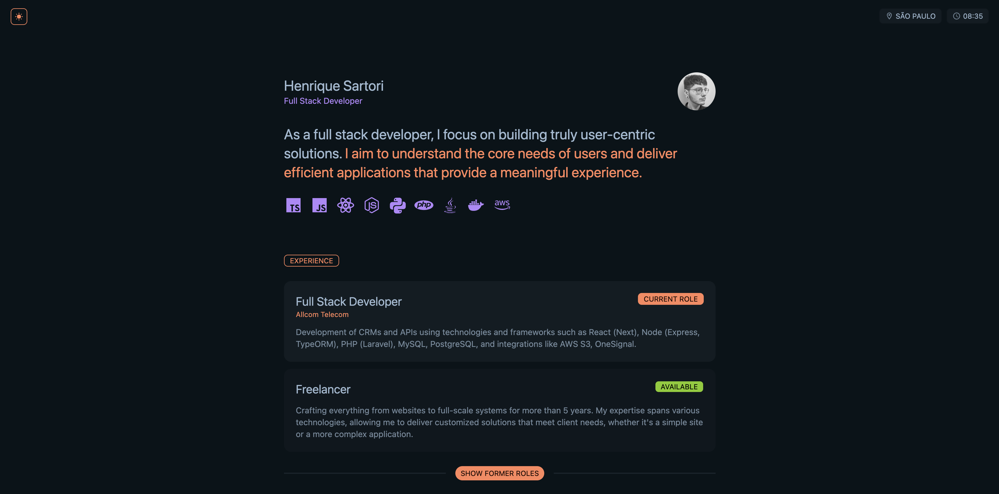

# Henrique Sartori - Portfolio

This is my personal potfolio, showcasing various projects and skills developed throughout my career as a developer.

**[LIVE VERSION](https://henriquesartori.github.io/portfolio)**

## Development
-  **Astro** - A modern static site framework for building fast, optimized websites.
-  **React** - A JavaScript library for building interactive user interfaces.
-  **GitHub Actions** - CI/CD automation for building and deploying the project.
- **GitHub Pages** - Hosting the portfolio via GitHub Pages with continuous deployment using GitHub Actions.

## License

This project is **All Rights Reserved**. No part of the portfolio, including code, images, and design, may be reproduced, modified, or used for any purpose without explicit permission.
